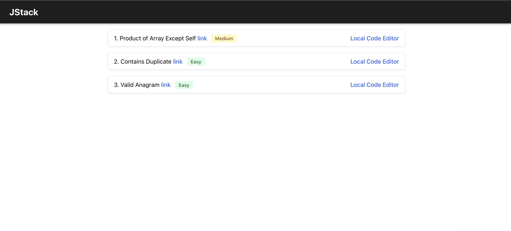
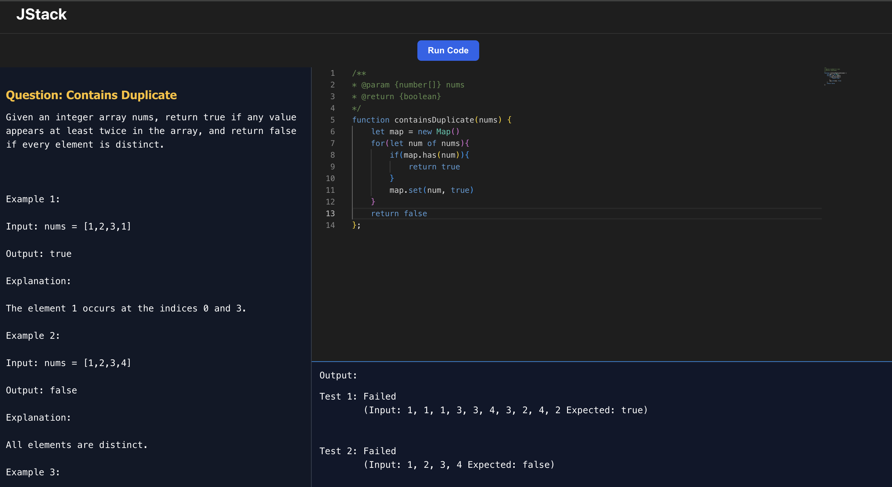

# Getting Started with Create React App
A platform offering JavaScript LeetCode-style coding questions with a built-in code editor and test cases, along with resources on design patterns, JavaScript and React quizzes, and system design interview questions.

## Tech Stack
React, React-Router, Context API, React Hooks, CSS, HTML5

[LIVEURL](https://kaidencoder.github.io/JStack)

### SCREENSHOTS OF APP

